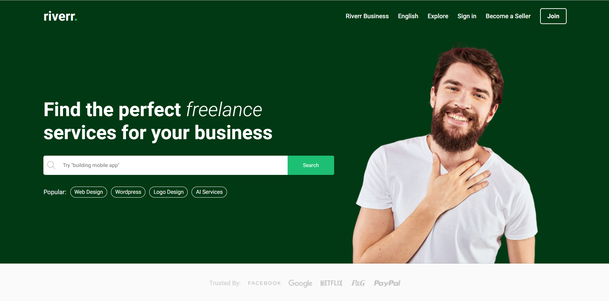

# RIVERR - Freelance Marketplace Web Application



RIVERR is a freelance marketplace website, a clone ofa fiverr.com, where users can create buyer and seller profiles, offer gigs, communicate with each other, and make payments using the Stripe API.

## Tech Stack Used

- Front-end: ReactJS, SCSS modules, React-Router Dom, Axios, React Query, Cloudinary
- Back-end: Node.js, Express.js
- Payment Integration: Stripe API
- Database: MongoDB, Mongoose

## Features of App I'm Proud Of

- User authentication and profile creation
- Gig creation and deletion functionality
- Sorting gigs based on categories and price
- Review system allowing buyers to provide feedback on gigs
- Page for viewing all successful orders
- Chat/messaging system for communication between sellers and buyers
- Order Placing & Payment System Using STRIPE

## Live Site

Check out the live site: [RIVERR Live](https://master--amazing-tarsier-1b80f4.netlify.app/)

## How to Contribute

Thank you for your interest in contributing to RIVERR! To get started, please follow the steps below:

1. Fork the repository and clone it to your local machine:

```git clone [repo-link]```

2. Install dependencies for the backend by navigating to the "api" folder and running:

```npm install```

3. Install dependencies for the frontend by navigating to the "client" folder and running:

```yarn```

4. Run the backend server at port [http://localhost:5000/](http://localhost:5000/):

```npm run start```

5. Run the front-end app at [http://127.0.0.1:5173/](http://127.0.0.1:5173/):

```yarn run dev```

6. Make your desired changes and enhancements to the codebase.

7. Commit your changes, push them to your forked repository, and create a pull request.

We appreciate your contribution and will review your pull request as soon as possible!


